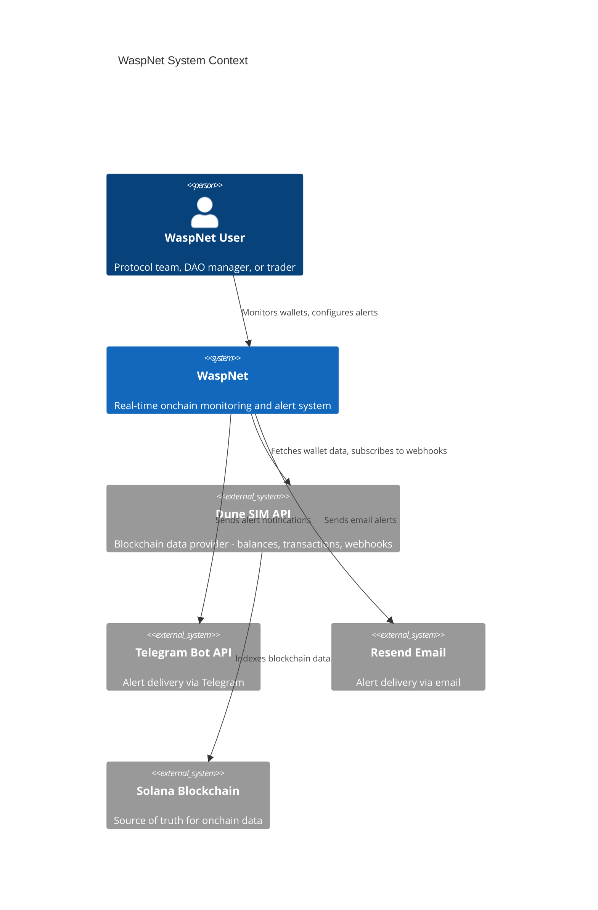
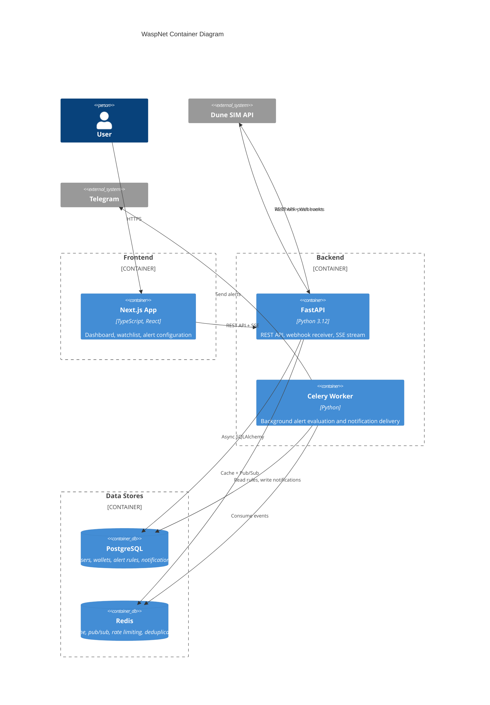
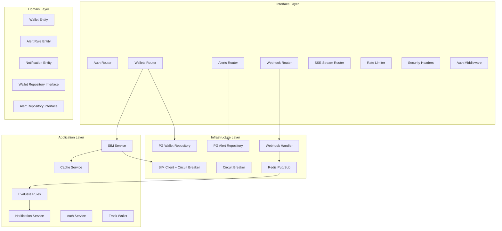
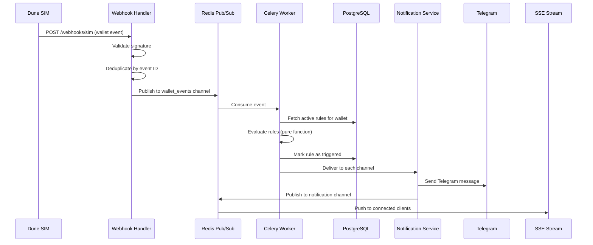

# WaspNet Architecture

## Overview

WaspNet is a real-time onchain monitoring and smart alert system — "PagerDuty for Solana." It uses Dune SIM API as the core data layer for wallet balances, transactions, cross-chain activity, and real-time webhooks.

## C4 Model

### Level 1: System Context

### Level 2: Container Diagram

### Level 3: Component Diagram (Backend)

## Data Flow

### Webhook Event Processing

## Rate Limiting Algorithms

| Algorithm | Use Case | Implementation |
|-----------|----------|----------------|
| Token Bucket | Per-IP rate limiting | Burst-tolerant, Redis Lua script |
| Leaky Bucket | Notification throttle | Constant drain rate, no spam |
| Fixed Window | Daily user quota | Simple counter with expiry |
| Sliding Window | Per-minute API limit | Most accurate, sorted set |

## Technology Decisions

| Decision | Choice | Rationale |
|----------|--------|-----------|
| Backend Framework | FastAPI | Async-native, Pydantic v2 integration, OpenAPI auto-docs |
| Data Layer | Dune SIM | Hackathon sponsor, real-time webhooks, low-latency REST |
| Cache | Redis | Sub-ms reads, pub/sub, rate limiting, all in one |
| Auth | JWT | Stateless, short-lived access + long-lived refresh |
| Background Tasks | Celery | Battle-tested, Redis broker, retry support |
| Frontend | Next.js 14 | App Router, SSR, TanStack Query integration |
