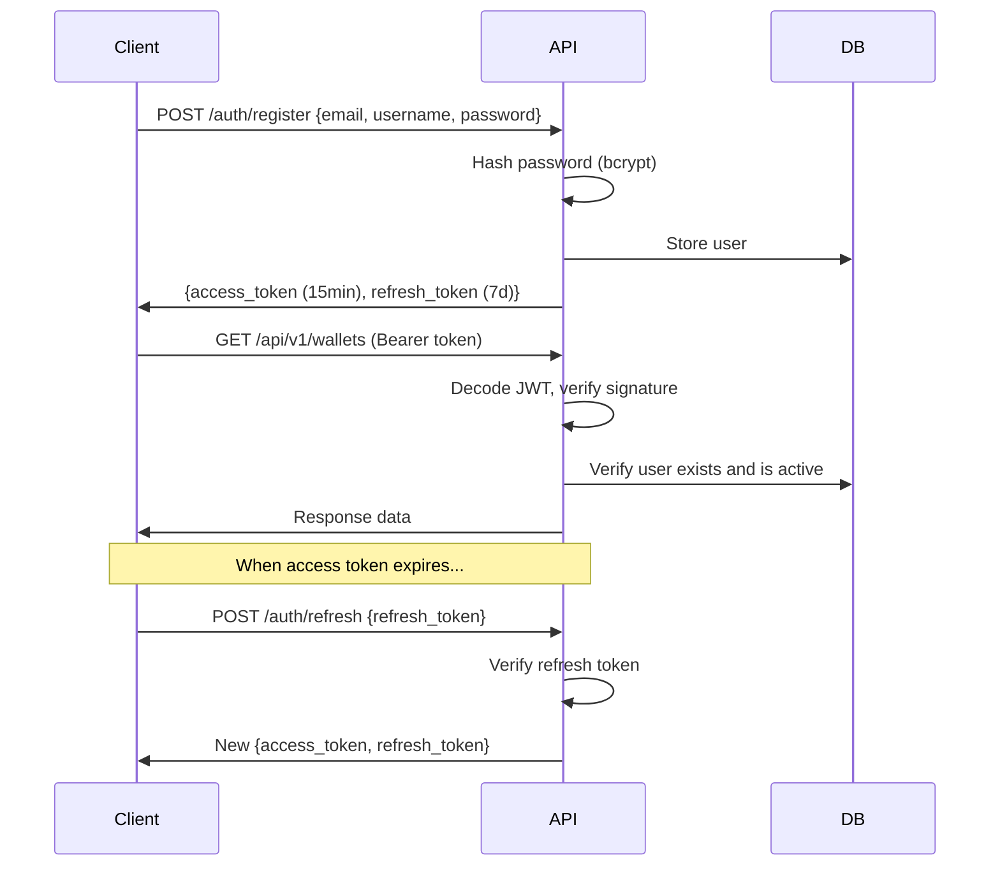

# ChainRadar — Security Documentation

## Threat Model (STRIDE)

| Threat | Category | Risk | Mitigation | Status |
|--------|----------|------|------------|--------|
| API key leaked in logs | Information Disclosure | High | SIM_API_KEY only in env vars, logged as [REDACTED] | ✅ |
| Spoofed webhook events | Spoofing | High | HMAC-SHA256 signature verification on all webhook payloads | ✅ |
| SQL injection | Tampering | Critical | SQLAlchemy ORM only — no raw SQL string interpolation | ✅ |
| XSS in alert messages | Tampering | Medium | Content-Security-Policy header, sanitized output | ✅ |
| Brute force login | Spoofing | High | Rate limiting (token bucket per-IP: 60 req/min) | ✅ |
| Token theft | Elevation of Privilege | High | Short-lived access tokens (15min), refresh tokens (7d) | ✅ |
| DDoS on webhook endpoint | Denial of Service | High | Rate limiting + Cloudflare WAF (documented) | ✅ |
| Clickjacking | Tampering | Medium | X-Frame-Options: DENY | ✅ |
| MIME sniffing | Information Disclosure | Low | X-Content-Type-Options: nosniff | ✅ |
| Duplicate notifications | Repudiation | Medium | Idempotency keys on all notification deliveries | ✅ |
| Stale JWT after deactivation | Spoofing | Medium | DB check on every authenticated request | ✅ |
| Private key exposure | Information Disclosure | Critical | No wallet private keys stored or processed | ✅ |
| CORS bypass | Spoofing | Medium | Whitelist-only CORS (frontend domain only) | ✅ |
| Email enumeration | Information Disclosure | Low | Generic "Invalid credentials" error on login | ✅ |

## Security Headers

All responses include:
- `Strict-Transport-Security: max-age=31536000; includeSubDomains; preload`
- `X-Frame-Options: DENY`
- `X-Content-Type-Options: nosniff`
- `X-XSS-Protection: 1; mode=block`
- `Referrer-Policy: strict-origin-when-cross-origin`
- `Content-Security-Policy: default-src 'self'; ...`
- `Permissions-Policy: camera=(), microphone=(), geolocation=(), payment=()`

## Authentication Flow

## Rate Limiting Strategy

| Layer | Algorithm | Limit | Purpose |
|-------|-----------|-------|---------|
| Per-IP | Token Bucket | 60 req/min, burst 60 | Prevent abuse from single IP |
| Per-User | Sliding Window | 60 req/min | Fair usage per authenticated user |
| Daily Quota | Fixed Window | 1000/day (free tier) | Tiered usage enforcement |
| Notifications | Leaky Bucket | 10 queue, 0.5/sec drain | Prevent notification spam |

## Input Validation

- All request bodies validated by Pydantic v2 strict mode
- Wallet addresses: base58 check (Solana) or hex check (EVM) BEFORE any API call
- SQL injection impossible — SQLAlchemy ORM only, parameterized queries
- Path traversal blocked — no file system access from API
